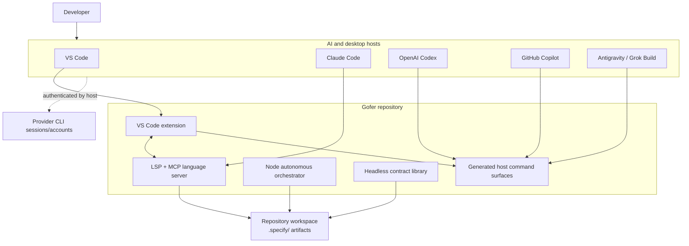
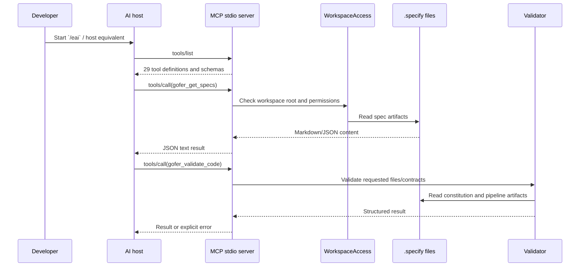
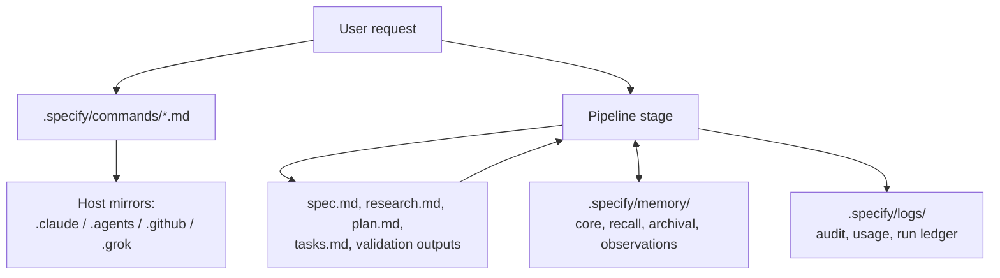

# Gofer Architecture

## System Context

## Representative Runtime Flow

## Components

| Component | Location | Responsibility |
| --- | --- | --- |
| Extension host | `extension/src/extension.ts` | Activates on startup/view use, registers commands and providers, starts LSP client, and manages workspace state. |
| Extension services | `extension/src/services/` | Configuration, migration, resource sync, lifecycle, logging, and workflow contracts. |
| Autonomous subsystem | `extension/src/autonomous/` | Context compaction, memory, cost/usage tracking, scope guard, audit, task graph, and progress. |
| Command council | `extension/src/council/` | Detects host and generates Claude/Codex/Copilot/Antigravity/Grok/VS Code surfaces from canonical commands. |
| Language server | `language-server/src/server.ts` | LSP initialization, workspace loading, custom requests, and experimental MCP compatibility. |
| Standalone MCP runtime | `language-server/src/mcpServer.ts` | Native MCP `tools/list` and `tools/call` over stdio with schema validation and permission gates. |
| Tool registry/handler | `language-server/src/mcp/` | Defines the 29 tools, dispatches calls, checks access, and executes workspace operations. |
| Orchestrator | `src/orchestrator/` | CLI-driven task queue and autonomous execution over spec directories. |
| Headless contracts | `src/headless/` | Release, audit, handoff, export-bundle, validation, and delivery-lineage contracts. |

## Data and Control Flow

## Design Patterns and Boundaries

- **Dependency injection:** `tsyringe` wires extension services through
  `extension/src/di/`.
- **Registry/dispatcher:** `TOOL_REGISTRY` co-locates MCP metadata and handler
  dispatch, so discovery and invocation share one contract.
- **Repository/file adapter:** `GoferLoader`, `SpecLoader`, and
  `WorkspaceAccess` centralize bounded file access and caching.
- **Strategy/generator:** canonical stage contracts emit multiple host-specific
  surfaces.
- **Observer/event model:** VS Code events and `chokidar` watchers refresh UI,
  specs, memory, and generated resources.

## Trust, Authentication, and Authorization

Gofer has no hosted authentication layer. Provider login is delegated to each
host/CLI. The standalone MCP runtime requires an explicit absolute
`--workspace-root`; default startup permits bounded artifact reads only.
`--allow-write` and `--allow-execution` are narrow startup permissions, while
`--allow-workspace-tools` enables legacy broad tools. These are trusted process
startup decisions, not model-controlled arguments, and the runtime explicitly
states it is not an OS sandbox.

Additional controls include path traversal checks, normalized artifact allowlists,
JSON-schema validation, one active MCP call at a time, cancellation handling,
ScopeGuard protected-file modes, and local tool-audit logging. Secrets are
expected in provider sessions, shell/CI secret stores, or ignored `.env` files.
