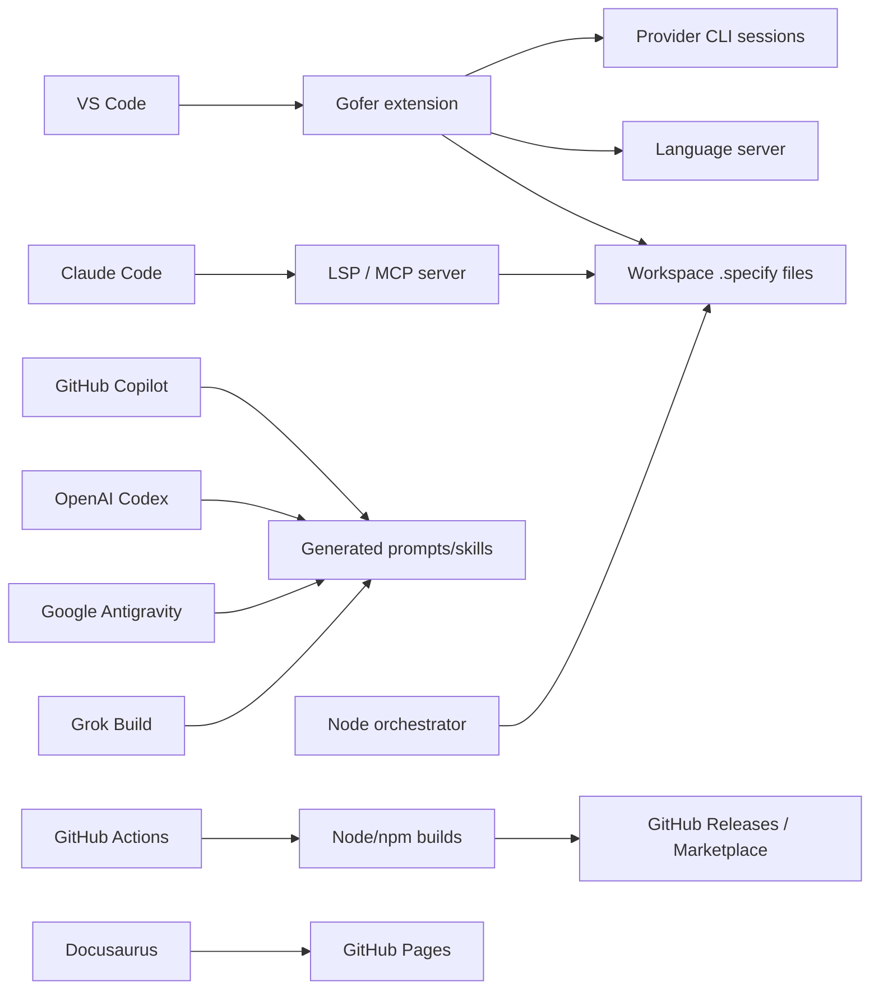

# Gofer Dependencies

## Dependency Map

## Runtime and Build Dependencies

| Dependency | Kind | Used by | Purpose |
| --- | --- | --- | --- |
| Node.js `>=24` | Runtime | all components | JavaScript/TypeScript execution |
| VS Code `^1.93.0` | Host platform | extension | UI, commands, workspace APIs |
| `vscode-languageserver` and textdocument | Protocol library | language server | LSP server |
| `@modelcontextprotocol/sdk` | Protocol library | language server | Native MCP stdio server |
| `tsyringe`, `reflect-metadata` | Framework | root/extension | Dependency injection |
| `zod`, `yaml`, `gray-matter` | Parsing/validation | all | Config, frontmatter, schema handling |
| `chokidar` | File watching | root/extension/server | Artifact and usage change detection |
| `winston` | Logging | root | Structured local logging |
| Vitest, Playwright, VS Code Test CLI | Development/test | repository | Unit, browser, and extension tests |
| Docusaurus 3.10.1 | Documentation site | `docs-site` | GitHub Pages build |

## Upstream Dependencies

- Provider CLIs/accounts: Claude Code, Codex, and supported host applications.
- VS Code runtime and extension APIs.
- GitHub APIs/actions for releases, Pages, optional update checks, and
  marketplace publishing.
- npm registry for package installation.

## Downstream Consumers

- Developers using the VS Code extension.
- MCP-capable AI hosts invoking the 29 registered tools.
- Claude/Codex/Copilot/Antigravity/Grok host surfaces consuming generated
  commands, prompts, skills, or plugins.
- GitHub Pages readers consuming the Docusaurus site.

No Azure database, REST backend, message broker, or hosted Gofer service is
declared in the current source.

## Downstream Dependents

Known downstream dependents include the central `tech-docs` aggregation flow and any repo-local `docs-site` publisher that renders content from `.tech-docs/`. Service-specific downstream consumers should remain documented here as they are confirmed from code or runtime contracts.
