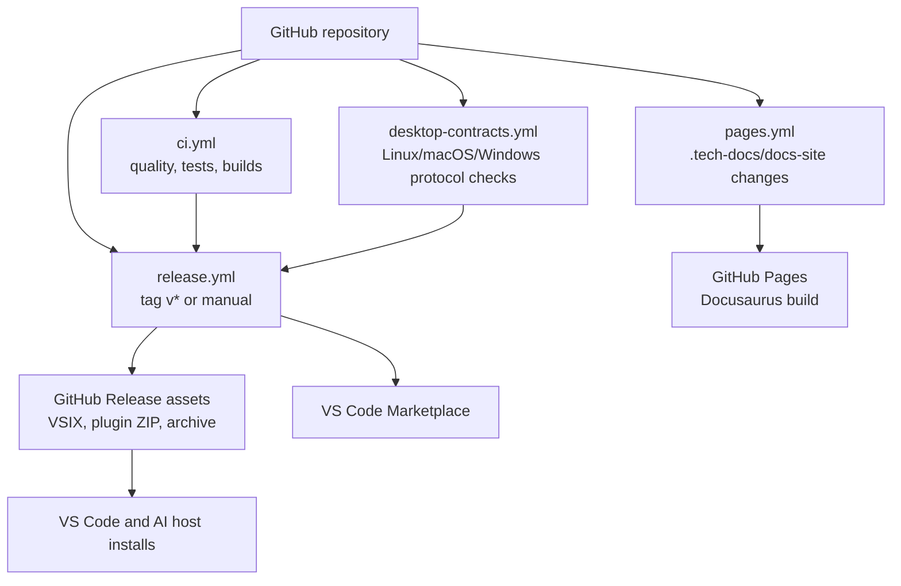

# Gofer Deployment and Operations

## Topology

## Runtime Packaging

| Artifact | Build path | Consumer |
| --- | --- | --- |
| Root orchestrator | `npm run build` → `dist/` | Node CLI/runtime |
| Language server | `npm --prefix language-server run build` | VS Code and MCP hosts |
| VS Code extension | `npm --prefix extension run compile`; `vsce package` | VS Code |
| Agent plugin | `npm run gofer:package-plugin` | Claude/Codex/Copilot plugin surfaces |
| Documentation | `npm --prefix docs-site run build` | GitHub Pages |

## CI/CD

- `ci.yml` runs lint, formatting, type checks, unit/coverage, generated-surface
  checks, component builds, E2E tests, npm audit, and packaging prerequisites.
- `desktop-contracts.yml` tests native protocol behavior on Ubuntu, macOS, and
  Windows and verifies packaged runtime behavior.
- `release.yml` runs on `v*.*.*` tags or manual dispatch, packages the VSIX,
  plugin ZIP, and release archive, creates a GitHub release, and publishes to
  the VS Code Marketplace using Microsoft Entra workload identity when the
  configured repository variables are present.
- `pages.yml` builds Docusaurus from `.tech-docs/`, verifies required release
  assets, and deploys `docs-site/build` to GitHub Pages.

No Azure App Service, Azure Functions, Cosmos DB, Kubernetes, or container
runtime is declared. Azure appears only as the optional marketplace publishing
identity integration.

## Health and Recovery

There is no network health endpoint. Health signals are:

- LSP/MCP process startup and protocol tests.
- VS Code extension activation and language-server connection.
- CI job status and packaged-runtime tests.
- Local context-health/status-bar and Gofer output logs.

Rollback is distribution-specific: install a prior VSIX/plugin release or
redeploy a prior Git commit to Pages. Workspace artifacts are recovered from
Git; logs and caches can be regenerated.
