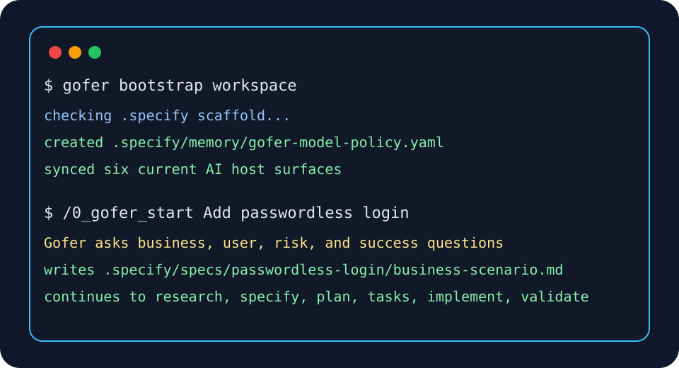

# EAI Gofer

EAI Gofer is a business specification-driven delivery workflow for repositories.
Users talk to `/eai`, and use `/eai-update` when they need to install or update
Gofer. Gofer manages the pipeline that designs with you, builds with you, and
validates the result. It keeps working artifacts in `.specify/` and ships across
VS Code, Claude Code, Codex, GitHub Copilot, Gemini, and Grok Build.

EAI Gofer is designed to be easy to adopt in an existing repo:

- helps everyone, not just coders, write good code, that delivers a business
  outcome
- Work with AI to generate what you need whether it is business case, executive
  summary, technical diagram of otherwise for you and your stakeholders to know
  what will be built, not find out it is wrong later
- one public `eai` entrypoint backed by the full internal delivery pipeline
- closed-loop goal reconciliation with repo-owned goal ledgers and drift checks
- repo-owned artifacts and templates
- install paths for VS Code and AI coding CLIs
- generated public command surfaces that stay aligned across hosts

## Quick Start



1. Install the VS Code extension or add the public plugin marketplace for your
   preferred CLI.
2. Start every request with `/eai`. Use `#eai` in Copilot-style prompts and
   `$eai` in hosts that use dollar-prefixed skills.
3. If you only need to add Gofer to an existing repo, run **Gofer: Initialize
   Repository** in VS Code, then refresh/restart the host command picker.
4. Gofer checks first-run readiness, workspace health, EAI CLI/login/tenant
   state, and then routes the internal pipeline for you.

If `/eai` is unknown, use `/eai-update` in a host where Gofer is already
available. It updates the host plugin without requiring a repo or EAI login. For
a first install, use the matching command in the
[5-minute first run guide](./.tech-docs/first-run.md).

The guide also includes a public Node.js bootstrap command. It installs Gofer
without a repository for Claude, Codex, Copilot, Gemini, or VS Code.

## App-Native Integration Model

Gofer now uses a light-plugin model across AI coding apps. The repo remains the
source of truth for `.specify/commands/`, `.specify/scripts/`, templates,
references, specs, and memory. App plugins and app-native customizations provide
thin entry points that check/bootstrap the repo and then route through the
repo-owned internal contracts.

| Surface                         | Clean entry point             | Repo integration                                                                                      |
| ------------------------------- | ----------------------------- | ----------------------------------------------------------------------------------------------------- |
| Codex App / Codex IDE           | `eai` or `eai-update` skill   | `AGENTS.md`, `.agents/skills/`, `.specify/scripts/`, `.vscode/mcp.json`                               |
| VS Code / GitHub Copilot app    | `#eai` or `#eai-update`       | `.github/agents/`, `.github/skills/`, `.github/prompts/`, `.github/instructions/`, `.vscode/mcp.json` |
| Claude Code app                 | `/eai` or `/eai-update`       | `.claude/skills/`, `.claude/commands/`, `.claude/agents/`, `.specify/scripts/`                        |
| Gemini CLI / Gemini Code Assist | `/eai` or `/eai-update`       | `.gemini/`, `.specify/scripts/`, `.vscode/mcp.json`                                                   |
| Grok Build                      | Ask Grok to use the EAI skill | `.grok/skills/`, `.specify/scripts/`                                                                  |

The UX rule is: users start with `eai`; `eai-update` is the only support
command. Gofer keeps numbered stages and helpers as internal contracts under
`.specify/commands/`, then chooses the right one based on the current feature
state. The `gofer` entrypoint remains as a compatibility alias, but public
instructions should teach `/eai`.

For copy-paste commands across VS Code, Claude Code, Codex, Copilot, Gemini, and
Grok, see the [5-minute first run guide](./.tech-docs/first-run.md).

## How The Pipeline Works

Users do not manually run stage commands. Write normal requests as `/eai ...`
and Gofer will:

1. Check the repo scaffold, EAI CLI, login, tenant, and app-template readiness.
2. Work out the current feature state from `.specify/specs/`.
3. Ask business-level questions when the goal, audience, value, risk, or tenant
   context is unclear.
4. Run the internal stage contracts for research, specification, planning,
   tasks, implementation, and validation.
5. Show the UI as early and as often as practical when an app UI is involved.
6. Keep business-owner, CTO, CISO, architecture, testing, and validation
   artifacts current.

The internal pipeline still has clear stages:

| Internal stage | What Gofer does                                               | Main output                                    |
| -------------- | ------------------------------------------------------------- | ---------------------------------------------- |
| Start          | Understands the business outcome and checks EAI readiness     | feature folder, business scenario              |
| Research       | Explores the repo, EAI platform fit, constraints, and options | `research.md`                                  |
| Specify        | Turns the need into requirements and acceptance criteria      | `spec.md`                                      |
| Plan           | Designs architecture, data, contracts, and delivery approach  | `plan.md`, `data-model.md`, `contracts/`       |
| Tasks          | Breaks the plan into ordered implementation work              | `tasks.md`, `traceability.md`, `issues.md`     |
| Implement      | Makes code and documentation changes with feedback loops      | code and document changes                      |
| Validate       | Checks quality, security, evidence, tests, and business fit   | validation artifacts and final review evidence |

Validation is the terminal quality gate. The previous standalone
engineering-review stage is folded into validation.

Gofer now treats the pipeline as a closed loop, not just a straight line:

- Research seeds `goal-ledger.json` with business goals, metrics, owners,
  delivery states, and re-loop triggers.
- Tasks keeps `traceability.md` as the requirement-to-task-to-code contract.
- Validation runs the objective outcome gate, refreshes code/test evidence, and
  writes `goal-rebaseline-report.md` when goals, assumptions, contracts, UX
  scope, or implementation drift.

Each stage also maintains a running product-release PR/FAQ in
`working-backwards-prfaq.md`, with immutable stage snapshots in
`prfaq-history/`. Gofer uses that same evidence to keep stakeholder review
documents current:

| Persona            | Summary document              | Built from                                                                                                    |
| ------------------ | ----------------------------- | ------------------------------------------------------------------------------------------------------------- |
| Business Owner     | `business-owner-summary.md`   | `problem-brief.md`, `discovery.md`, `spec-summary.md`, `business-metrics.md`, value stream evidence, ROI      |
| CTO / Architecture | `cto-architecture-summary.md` | `plan.md`, `contract-pack.md`, `data-model.md`, C4 diagrams, `service-fit-matrix.md`, EAI preflight           |
| CISO / Risk        | `ciso-security-summary.md`    | `validation-report.md`, `audit-history.md`, risk heatmap, auth/tenant controls, secret/data handling evidence |

Gofer also scores visual communication during validation. Architecture, process,
security, UI, and EAI Platform visuals must be simple, rendered or
fallback-safe, source-controlled, traceable to requirements and code/test
evidence, and safe for public or stakeholder review. Crowded, stale, unrendered,
or private-data-bearing diagrams fail the architecture compliance gate.

Human-facing documents should start with a short executive summary in plain
language. Mermaid is the default for Markdown-native diagrams, Marp is
recommended when stakeholders need a slide narrative, D2/Structurizr-style
source is acceptable when it makes architecture clearer, and UI behavior should
be backed by screenshots, Storybook/component proof, Playwright evidence, or an
equivalent render check.

Optional helpers stay available internally for problem validation, checkpoints,
branding, test generation, stakeholder communications, workspace checks,
bootstrap, and first-run EAI setup. Users should still ask through `/eai`, for
example: `/eai rebrand the stakeholder documents with our company logo`.

## Model And Cost Policy

EAI Gofer bootstraps a repo-owned model policy at:

```text
.specify/memory/gofer-model-policy.yaml
```

The shipped default comes from `.specify/templates/gofer-model-policy.yaml`.
Bootstrap creates the memory copy when it is missing and does not overwrite
local edits.

Default posture:

- Claude: Haiku for simple scouting, Sonnet for normal work, Opus for hard
  security/architecture/release gates.
- Codex/OpenAI: GPT mini for simple coding, GPT nano only for mechanical
  locate/classify/summarize work, GPT-5.3-Codex or flagship GPT for hard
  tool-heavy coding and arbitration.
- Gemini: Flash-Lite for cheap large-context scanning, Flash for normal
  synthesis, Pro for hard large-context architecture/research gates.
- Copilot: `Auto` for simple/default work; ask before selecting a paid/high-tier
  picker model for hard review.

## Install

### VS Code

Recommended: install from the VS Code Marketplace so users receive normal
Marketplace updates. Manual `.vsix` installs remain supported, but VS Code does
not auto-update VSIX installs by default.

- Marketplace listing:
  [EnterpriseAI.gofer](https://marketplace.visualstudio.com/items?itemName=EnterpriseAI.gofer)
- Marketplace docs:
  [Use extensions in Visual Studio Code](https://code.visualstudio.com/docs/getstarted/extensions)
- Publishing/update behavior:
  [Publishing Extensions](https://code.visualstudio.com/api/working-with-extensions/publishing-extension)
- VSIX update note:
  [Extension Marketplace](https://code.visualstudio.com/docs/editor/extension-marketplace?azure-portal=true)

Public release assets:

- Latest VSIX:
  `https://eai-support.github.io/eai-gofer/releases/eai-gofer-latest.vsix`
- Versioned releases: `https://eai-support.github.io/eai-gofer/releases/`

VS Code and Copilot agent mode also receive repo-local customization files:
`.github/agents/`, `.github/skills/`, `.github/prompts/`,
`.github/instructions/`, and `.vscode/mcp.json`.

Maintainer release note: stable releases publish the GitHub Release and public
Gofer feed first, because those are the authoritative artifacts used by
`eai gofer refresh` and the plugin ZIP install path. GitHub Actions then
attempts to publish `EnterpriseAI.gofer` to the Visual Studio Marketplace using
Microsoft Entra workload identity and `vsce publish --azure-credential`. The
workflow expects repository variables `VSCE_AZURE_CLIENT_ID`,
`VSCE_AZURE_TENANT_ID`, and `VSCE_AZURE_SUBSCRIPTION_ID`, with the federated
identity authorized as a Contributor on the `EnterpriseAI` Marketplace
publisher. `VSCE_PAT` is retained only as a legacy fallback because Azure DevOps
global PATs are being retired.

### Claude Code

Recommended install path:

```bash
claude plugin marketplace add eai-support/eai-gofer --scope user --sparse .claude-plugin --sparse plugins/eai-gofer
claude plugin install eai-gofer@eai-gofer --scope user
```

References:

- [Discover and install plugins](https://code.claude.com/docs/en/discover-plugins)
- [Create and distribute a plugin marketplace](https://code.claude.com/docs/en/plugin-marketplaces)
- [Plugins reference](https://code.claude.com/docs/en/plugins-reference)

### Codex

Recommended install path:

```bash
codex plugin marketplace add https://github.com/eai-support/eai-gofer --sparse .agents/plugins --sparse plugins/eai-gofer
codex plugin add eai-gofer@eai-gofer
```

References:

- [Codex App](https://developers.openai.com/codex/app)
- [Codex plugins](https://developers.openai.com/codex/plugins)

The Codex plugin exposes `eai` as the recommended public skill, with `gofer`
retained as a compatibility alias. It does not expose a second namespaced copy
of every stage command. In an initialized repo, start with the plain `eai` skill
from `.agents/skills/`.

### GitHub Copilot CLI

Recommended install path:

```bash
copilot plugin marketplace add https://github.com/eai-support/eai-gofer
copilot plugin install eai-gofer@eai-gofer
```

References:

- [GitHub Copilot app](https://docs.github.com/en/copilot/how-tos/github-copilot-app)
- [Finding and installing Copilot CLI plugins](https://docs.github.com/en/copilot/how-tos/copilot-cli/customize-copilot/plugins-finding-installing)
- [Copilot CLI plugin marketplace](https://docs.github.com/en/copilot/how-tos/copilot-cli/customize-copilot/plugins-marketplace)

### Gemini CLI

Recommended install path:

```bash
gemini extensions install https://github.com/eai-support/eai-gofer --auto-update
```

Reference:

- [Gemini CLI extensions reference](https://github.com/google-gemini/gemini-cli/blob/main/docs/extensions/reference.md)

### Downloadable Bundle

For offline testing or pinned installs, use the public agent bundle zip:

```bash
curl -fsSL https://eai-support.github.io/eai-gofer/releases/eai-gofer-agent-plugin-latest.zip \
  -o /tmp/eai-gofer-agent-plugin-latest.zip
```

The public release feed is:

```text
https://eai-support.github.io/eai-gofer/releases.json
```

## First EAI Platform App Setup

`/eai` replaces the long website setup prompt for users who have installed a
supported AI coding host. It can run before `.specify/` exists in the target
repo, because Gofer routes first-run setup internally when the machine, login,
tenant, template, or scaffold is not ready.

When first-run setup is needed, Gofer:

- detects Claude Code, Codex, Copilot, Gemini, VS Code, GitHub Codespaces, OS,
  shell, and workspace folder
- checks Git, Node.js, npm, the scoped EAI npm registry, and `eai --version`
- asks before installing Git, Node.js, npm, EAI CLI, opening browser login, or
  changing tenant/project state
- uses `npm install -g eai-cli` when EAI CLI installation is approved, with
  `npm install -g @enterpriseai/cli --@enterpriseai:registry=https://eai-support.github.io/eai/registry/`
  as the static-registry fallback when npmjs is unavailable
- runs `eai update --check`, `eai --describe`, `eai whoami`, and
  `eai tenant list --format json` before assuming CLI syntax or tenant readiness
- does not invent EAI CLI commands; it verifies command paths and flags with
  `eai --describe` and command-specific `--help` before suggesting or running
  them
- runs `eai agent guide --format json` when advertised, and after `eai` errors
  uses `eai errors explain <code-or-reason> --format json` before guessing a
  workaround
- asks for the project display name, proposes a lowercase kebab-case CLI name,
  confirms the active tenant, then runs
  `eai init <project-name> --skip-prompts --company-tenant <active-tenant-id>`
  when approved
- treats `E001` from `eai verify`, `eai template check`, or
  `eai doctor --check-updates` as "this repo is not yet an EAI app project",
  then offers initialization instead of leaving the user at a dead end
- runs `eai template check --format json` and
  `eai gofer refresh --check --format json` when the repo already looks like an
  EAI app so Gofer can see EAI template drift and Gofer scaffold drift early
- uses `eai resources schema --format json` and
  `eai workflow readiness --format json` later in the pipeline to ground block,
  data, and workflow choices in actual platform capabilities
- verifies `.specify/` and Gofer files created by `eai init`, bootstraps the
  repo scaffold if it is missing or stale, and writes a safe
  `.specify/logs/eai-first-run-report.md`

Cross-platform behavior:

| Environment       | Behavior                                                                               |
| ----------------- | -------------------------------------------------------------------------------------- |
| macOS             | Use Homebrew only when it already exists; otherwise use standard installers.           |
| Linux             | Prefer existing tools; detect `apt`, `dnf`, `yum`, or `zypper` if install is approved. |
| Windows           | Use PowerShell-safe commands and prefer `winget`; do not assume Git Bash.              |
| GitHub Codespaces | Prefer devcontainer/user-level npm and avoid `sudo` unless explicitly approved.        |

## Repository Layout

| Path                  | Purpose                                       |
| --------------------- | --------------------------------------------- |
| `extension/`          | VS Code extension package                     |
| `language-server/`    | Language server and MCP-facing support        |
| `src/`                | Node-based orchestration and utilities        |
| `.specify/commands/`  | Canonical command source                      |
| `.specify/templates/` | Repo bootstrap templates and helpers          |
| `.specify/specs/`     | Local working artifacts created per feature   |
| `plugins/eai-gofer/`  | Portable plugin bundle for CLI hosts          |
| `.claude/skills/`     | Claude Code app/plugin umbrella skill         |
| `.github/agents/`     | VS Code/GitHub Copilot custom agents          |
| `.github/skills/`     | VS Code/GitHub Copilot umbrella skill         |
| `.tech-docs/`         | Public documentation source for the docs site |

## Development

```bash
npm install
cd extension && npm run compile
cd ..
npm run build
npm run lint
npm run typecheck
npm test
npm run gofer:closed-loop-audit -- --feature-dir .specify/specs/<feature>
npm run gofer:generate
npm run gofer:package-plugin -- --sync-repo
```

## Community

- Questions and usage help:
  [GitHub Discussions](https://github.com/eai-support/eai-gofer/discussions)
- Bugs and feature requests:
  [GitHub Issues](https://github.com/eai-support/eai-gofer/issues)
- Project wiki: [GitHub Wiki](https://github.com/eai-support/eai-gofer/wiki)
- Security guidance: [SECURITY.md](./SECURITY.md)
- Contribution guidance: [CONTRIBUTING.md](./CONTRIBUTING.md)
- Support policy: [SUPPORT.md](./SUPPORT.md)

Roadmap-fit issues may also receive an automation-generated draft intake PR so a
human reviewer can scope the work before implementation starts.

## Related Projects And References

EAI Gofer sits in the same broader ecosystem as specification-driven and
agent-oriented developer tooling. Useful references:

- [GitHub Spec Kit docs](https://github.github.com/spec-kit/index.html)
- [github/spec-kit](https://github.com/github/spec-kit)
- [GitHub repository best practices](https://docs.github.com/en/repositories/creating-and-managing-repositories/best-practices-for-repositories)
- [GitHub Discussions quickstart](https://docs.github.com/discussions/quickstart)
- [Setting guidelines for contributors](https://docs.github.com/en/communities/setting-up-your-project-for-healthy-contributions/setting-guidelines-for-repository-contributors?apiVersion=2022-11-28)

## What Helps A Repo Get Forks And Stars

The basics are not optional:

- a permissive open-source license
- a 5-minute quick start that actually works
- clear screenshots or demos
- active issue triage and visible roadmap items
- contributor docs, security policy, and support routing
- predictable releases and changelog discipline
- public install/update paths for every supported host

EAI Gofer now uses the Apache-2.0 license. `Enterprise AI` and `EnterpriseAI`
remain Enterprise AI Pty Ltd marks; see [TRADEMARKS.md](./TRADEMARKS.md) and the
current legal page at
[enterpriseaigroup.com/terms-of-use](https://enterpriseaigroup.com/terms-of-use).

The remaining work before a real public launch is the final legacy-enterprise
cleanup.
