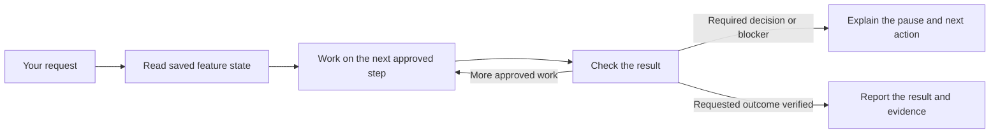

# When Gofer Pauses

Gofer should continue work that you have approved. It should not ask you to
choose a numbered stage or repeat approval for unchanged work.

A pause is appropriate when Gofer needs a decision, reaches a host limit,
loses access, or cannot verify the result. It must say what happened, what
was saved, and what you need to do next. A running server or a successful
model response does not prove that the feature is complete.

## How Work Continues

Gofer reads the internal files in `.specify/commands/`. It does not need a
Claude-only Skill tool or a removed numbered public command to move forward.
Research-only requests finish after research. Local MVP work does not need
future authentication or deployment features before a local preview.

## Copilot Desktop And VS Code

The GitHub Copilot app and Copilot Chat in VS Code are separate surfaces.
They can use repository skills, but they do not share every extension tool.
Gofer custom agents need the host's normal read, edit and execution tools
when their stage requires them. Missing optional Gofer tools must not cause
the agent to invent a command or silently finish.

Use the host's normal permission controls. Do not enable unrestricted tool
approval to fix a pause. If the host reaches a request or context limit,
Gofer must save progress and explain how to resume through `eai`.

The [Copilot app customization guide](https://docs.github.com/en/copilot/how-tos/github-copilot-app/customize-github-copilot-app)
describes app and repository instructions. The [VS Code settings reference](https://code.visualstudio.com/docs/agents/reference/ai-settings)
describes request limits and permission controls.

## Two Separate Connections

The editor language server and the chat tool server use different protocols:

| Connection | Purpose | Entrypoint |
| --- | --- | --- |
| LSP | Editor navigation, diagnostics and existing editor services | `language-server/dist/server.js` |
| MCP | Chat tool discovery and tool calls | `language-server/dist/mcpServer.js` |

The MCP process must receive an explicit workspace root. It must not select
a project from whichever directory the desktop app used to start it.
An old configuration that launches the LSP server as MCP is not a working
chat connection. Adding a transport flag alone does not repair the protocol.

The lightweight agent plugin uses repository scripts and does not include the
compiled MCP runtime. It therefore does not ship a dangling MCP configuration.
The VS Code extension packages and configures that runtime separately.

The repair migrates recognized Gofer-owned configurations only. Custom server
entries and invalid configuration files are not silently replaced. Review
the reported configuration issue before changing a custom setup.

## Permissions

MCP startup is not permission to run repository scripts or write files.
The new server keeps those operations behind explicit trusted configuration.
Never accept a model-supplied approval flag as user consent. Gofer can still
use normal host tools under the host's existing approval controls.

The default MCP configuration allows five bounded reads: specifications, next
task, pipeline state, stage instructions and documentation artifacts. All 29
tools remain listed. A denied tool returns a reason; it does not grant itself
permission.

For administrators: `--allow-write` alone does not enable legacy writes.
`--allow-write --allow-execution` permits repository execution with the process
account's access. `--allow-workspace-tools` permits all legacy operations,
including reads and writes outside the workspace. Neither option is an OS
sandbox. Generated configurations do not enable these options.

## Tests And Their Limits

All test sources are tracked in the repository. They are not temporary support
scripts. Before approving a PR, run the full Vitest suite (including unit, integration, and performance tests) with
`npm test`, the protocol checks below, and `npm --prefix extension test` for
the isolated VS Code tests. Build a VSIX and run the packaged check against
that exact file. These checks do not publish or update a user's plugin.

PR validation runs the full suite with coverage, VS Code tests, security checks,
and package checks. The desktop-contract workflow runs actual MCP/LSP processes
on Windows, macOS and Linux. Do not substitute a CLI smoke test for this set.

`release.sh` repeats the full Vitest suite, real-process checks,
and isolated VS Code tests before packaging. It then tests the built VSIX.
The publish phase repeats validation and checks the committed versioned VSIX
before creating a release tag.
Release and Pages publication also require the exact-commit desktop CI checks.
Each failed required check stops the process; do not skip it to publish.

`npm run test:mcp-protocol` builds the server and tests real child processes.
CI runs this check on Windows, macOS and Linux. `release.sh` must pass it
before packaging the extension. A failure stops the release gate.

`npm run test:packaged-protocol -- --vsix <file.vsix>` extracts a VSIX into a
separate temporary directory. It checks the packaged dependencies and runs the
same real-process tests without using the checkout's runtime dependencies.

Protocol tests do not prove a complete conversation in every desktop app.
For each desktop qualification, record the app version, loaded Gofer version,
workspace, request, tool results, continuation and final verification.
Keep these results separate from CLI, unit, package and protocol tests.

## A Useful Support Report

Provide the app name and version, loaded Gofer version, the last visible
message, the stage being worked on, and the last tool error if available.
State whether a permission prompt or a Continue button is visible.
Remove credentials and customer data before sharing logs.

Do not reinstall or clear your chat before saving this evidence. An update
may replace files on disk without changing the plugin loaded by an existing
chat. Follow that host's reload guidance and verify a fresh session.
