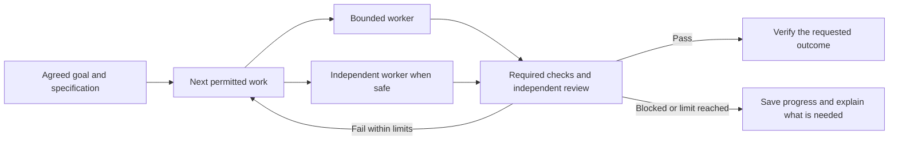

# Reliable Specialist Work

Gofer keeps its existing pipeline. You still use the same EAI entry point.
The change strengthens how specialist work is assigned, checked and stopped.

## What Changes

- Preserve all 42 specialist roles in one shared catalogue.
- Resolve tools and models for the current coding app.
- Require evidence before completing a task.
- Run approved independent tasks together within limits.
- Stop repeated attempts, conflicting edits and stale results.
- Keep missing native support visible instead of claiming a pass.

App and non-app routing, early MVP previews, business summaries, EAI platform
choices, authentication, branding, specifications and release checks remain.
No additional public specialist commands are introduced.

## Release Rubric

| Area | Weight | Required proof |
| --- | ---: | --- |
| Request and goal continuity | 20 | App/non-app/maintenance cases; changed direction survives restart. |
| Real outcome | 15 | Required missing or failing evidence prevents completion. |
| Repair and stop controls | 20 | Shared limits, unanswered blockers, cancellation and safe recovery. |
| Dependencies and parallel work | 20 | Real overlap for independent work; conflicts and prerequisites remain controlled. |
| Independent review | 10 | Separate qualified execution, current requirements and raw evidence. |
| Time, context and cost | 5 | Matched trials include failures and all calls; unavailable values remain unknown. |
| Surface preservation | 10 | Required functions pass on each claimed desktop and CLI surface. |

Scores require evidence. Package checks, simulated adapters and real local
processes are distinct from native model execution. Missing native proof
prevents a universal pass. A good task score cannot replace the feature's
outcome gate or a required security check.

## Current Limit

This PR provides an experimental controller and shared role resolution, not
universal native execution. The controller requires trusted host adapters.
Their isolation, remote cancellation, restart recovery and six-surface
end-to-end tests remain qualification work. No speed improvement is claimed.

See `.specify/references/verified-agent-execution.md` for the adapter contract.
