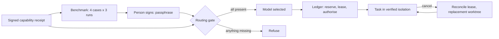

# Verified autonomous runtime: how routing is earned, and how to run it by hand

Gofer does not trust a fixed model name. It routes work to a model only when
three things are true at the same moment:

1. A **fresh signed capability receipt** says which models this machine's coding
   app really offers, in a verified isolation class.
2. A **signed independent benchmark** shows that model passing held-out tasks
   three times each. The result is bound to that exact receipt.
3. The **ledger** has authorised the task: reservation, lease, scope, approval.

If any of these is missing, stale or altered, Gofer refuses. This page explains
each step so that a person can do them by hand. Some steps need a person on
purpose: choosing a passphrase, running `sudo`, signing, and approving spend.

The policy file `.specify/memory/gofer-model-policy.yaml` is **advisory**. It
narrows what is allowed. It never chooses a model and never proves a capability.



## What is proven today, and what is not

Proven on one macOS machine with the OpenAI Codex app: a real worker ran in a
verified sandbox, was cancelled, was reconciled, and resumed. See
[the readiness assessment](verified-autonomous-runtime-readiness.md) for the
score, the evidence and the gaps. Other coding apps, Linux and Windows fail
closed. They are never given a static fallback.

## Prerequisites

| Need                                   | Check                                                                                                       |
| -------------------------------------- | ----------------------------------------------------------------------------------------------------------- |
| macOS, Node 24, `git`, `jq`, `openssl` | `node --version`                                                                                            |
| EAI CLI 3.16.0 or later                | `eai start <worktree> --isolation-check --surface codex-cli --format json` returns `eai.local-isolation/v2` |
| Codex CLI, signed by OpenAI            | `codesign -dv $(readlink -f $(command -v codex))` shows `TeamIdentifier=2DC432GLL2`                         |
| Codex signed in                        | `codex login status`                                                                                        |
| An admin account for one `sudo` step   | you know the password                                                                                       |

Codex may upgrade itself. Never hard-code its install path. The examples find it
on `PATH` each time.

## One-time setup per machine

All keys live in `~/.eai-gofer-trust`. The worker sandbox can **read** your home
folder (it cannot write). That is why the verifier key is encrypted and its
registry is root-owned. Do not skip those steps.

### 1. Stage the capability key

Gofer bootstrap creates it automatically. Check it exists:

```bash
ls ~/.eai-gofer-trust/staged-keys/capability-evaluator.private.pem
```

### 2. Activate the capability key (a trust decision: read it first)

The capability key only vouches for _which models exist_. It is not the
independence key. Activating it lets this machine issue receipts. Its private
key is a plaintext file, so a worker could read it. That is a known limit.

```bash
TRUST=~/.eai-gofer-trust
KEYID=$(jq -r '.[] | select(.name=="capability-evaluator") | .keyId' $TRUST/staged-keys/identities.json)
jq --arg id "$KEYID" --rawfile pem $TRUST/staged-keys/capability-evaluator.public.pem \
  '.evaluators += [{keyId:$id,host:"codex",evaluator:"gofer-native-host-evaluator",publicKeyPem:$pem}]' \
  $TRUST/trusted-evaluators.json > $TRUST/trusted-evaluators.json.new
chmod 600 $TRUST/trusted-evaluators.json.new && mv $TRUST/trusted-evaluators.json.new $TRUST/trusted-evaluators.json
mkdir -p $TRUST/active-keys && chmod 700 $TRUST/active-keys
install -m 600 $TRUST/staged-keys/capability-evaluator.private.pem $TRUST/active-keys/codex-evaluator.private.pem
printf '{"schemaVersion":1,"host":"codex","evaluator":"gofer-native-host-evaluator","keyId":"%s"}\n' "$KEYID" \
  > $TRUST/active-keys/codex-evaluator.json && chmod 600 $TRUST/active-keys/codex-evaluator.json
```

### 3. Create the verifier key (this is the independence key)

Run this **yourself, in a terminal**. It asks for a passphrase of at least 12
characters, twice. Nothing is echoed. Never run it through an agent.

```bash
node .specify/scripts/node/gofer-verifier-key-ceremony.mjs
```

It stores only an encrypted key. It prints two `sudo` commands. Run them. They
install a registry that only an administrator can change:

```bash
sudo mkdir -p "/Library/Application Support/EAI Gofer"
sudo install -o root -g wheel -m 0644 ~/.eai-gofer-trust/verifier-registry.pending.json \
  "/Library/Application Support/EAI Gofer/verifier-registry.json"
```

A verifier key that your own account registered is **ignored**. Only the
root-owned registry counts. To add a second key later, run the ceremony again;
it keeps earlier entries.

Delete any old plaintext verifier key. A worker can read it:

```bash
rm -f ~/.eai-gofer-trust/staged-keys/heldout-verifier.private.pem
```

Check the registry is trusted the way production checks it:

```bash
ls -l "/Library/Application Support/EAI Gofer/verifier-registry.json"   # root wheel, -rw-r--r--
```

### 4. Pin the held-out corpus

The four-case corpus (bug fix, refactor, cross-service contract, security
sensitive) lives in `~/.eai-gofer-trust/corpora/<id>/` and is pinned by
`~/.eai-gofer-trust/heldout-corpus.json` (its hash). The loader refuses a
changed corpus. Keep it out of the repository so workers never see it.

## Each benchmark cycle

A receipt lives up to 6 hours. The benchmark result is bound to that exact
receipt, so do steps 5 to 8 inside one receipt's life. Use a 4-hour receipt.

Use the examples in
[`docs/examples/verified-runtime/`](examples/verified-runtime). They are
operator examples adapted from the live proof. `<repo>` is a clean checkout of
this repository.

### 5. Issue a fresh receipt (free)

```bash
node docs/examples/verified-runtime/issue-receipt.mjs \
  --repo <repo> --out /abs/work/receipt.json --ttl-minutes 240
```

### 6. Run the benchmark (spends money)

Decide the caps **first**, and write down who approved them. Rates are list
price in US$ per million tokens (input,output). The worker and reviewer must be
different models. In the live proof, a full run cost about US$5.7 for 12 worker
runs and 12 reviews.

```bash
node docs/examples/verified-runtime/run-benchmark.mjs \
  --repo <repo> --receipt /abs/work/receipt.json --out /abs/work/result.json \
  --worker-model gpt-5.6-terra --worker-rate 2,12 \
  --reviewer-model gpt-5.6-sol --reviewer-rate 4,20 \
  --approval "approved by <name> on <date>" --max-run-usd 2 --max-total-usd 8
```

Each run is reserved at its worst case before it starts, so the total cannot
pass the cap. A run that cannot be metered, or that times out, is charged in
full. Move any earlier `receipts` folder out of the corpus first. The executor
will not overwrite an earlier run.

The script ends by printing a `snapshot` id. As a free extra check, re-run the
protected checks yourself in the offline sandbox. They must agree 12 of 12.

### 7. Sign (a person, at a terminal)

The command refuses to run without a terminal. It re-runs all 12 protected
checks itself before it signs. Pick an attestation lifetime that fits your work,
up to 240 minutes.

```bash
node .specify/scripts/node/gofer-benchmark-sign.mjs \
  --workspace-root <repo> --snapshot-id <snapshot id> \
  --capability-receipt /abs/work/receipt.json \
  --out /abs/work/attestation.json --ttl-minutes 180
```

### 8. Check the gate (free)

```bash
node docs/examples/verified-runtime/verify-routing.mjs \
  --repo <repo> --receipt /abs/work/receipt.json --attestation /abs/work/attestation.json
```

You should see three lines: it refuses without the benchmark, selects a model
with it, and refuses a tampered verdict.

### 9. Run a routed task

```bash
node .specify/scripts/node/gofer-run-verified-task.mjs --workspace <repo> \
  --capability-receipt /abs/work/receipt.json --benchmark /abs/work/attestation.json
```

Expect `"status":"verified"`. The report's `nativeQualification` field is a
fixed value and does not measure this evidence. Read the ledger and journal
instead.

### 10. Prove cancellation and resume (spends a little)

```bash
node docs/examples/verified-runtime/cancel-resume.mjs --repo <repo> \
  --receipt /abs/work/receipt.json --attestation /abs/work/attestation.json --out /abs/work/evidence
```

Check `evidence/verified-execution.jsonl` for `cancelled`, `cancel_reconciled`,
`resumed`, `verified`. Check `runtime-ledger.jsonl` for `cancel-reconciled` on
the first lease and `commit-authorize` on the second lease only.

## Spend rules

- Never start a paid run without a written cap and an approver.
- Keep a running total. The examples print it after every step.
- A usage limit from the provider stops a run at once and spends nothing.
- Buying credits is a person's decision, never an agent's.

## Problems you may meet

| Symptom                                                    | Cause                                                                | Fix                                                 |
| ---------------------------------------------------------- | -------------------------------------------------------------------- | --------------------------------------------------- |
| `LOCAL_SANDBOX_REQUIRED`                                   | EAI CLI too old                                                      | Update it. Version 3.16.0 or later                  |
| Issuer works but a benchmark fails at the first call       | Receipt lifetime too short (default 5 minutes)                       | Issue with `--ttl-minutes 240`                      |
| `spawn ... codex ENOENT`                                   | Codex upgraded and its path changed                                  | Use the examples, which find it on `PATH`           |
| `You've hit your usage limit`                              | Provider limit                                                       | Wait for the reset, or a person adds credits        |
| `BENCHMARK_EXECUTOR_REQUIRED` at once                      | An earlier `receipts` folder exists, or the first worker call failed | Move the old folder aside and read the worker error |
| Gate says `TRUSTED_BENCHMARK_REQUIRED`                     | Attestation altered, expired, or bound to another receipt            | Sign again for the current receipt                  |
| `INDEPENDENT_BENCHMARK_REQUIRED`                           | No attestation given                                                 | Complete steps 6 to 8                               |
| `CALL_LIMIT` blocks a task                                 | Call limit too low (a task needs 9 calls)                            | Use a limit of 12 or more                           |
| Resume refuses                                             | Loop allows one attempt                                              | The smoke feature allows two; a restart needs two   |
| A verified run leaves a `gofer-isolated-worktree-*` folder | Known cleanup gap                                                    | `git worktree remove --force <path>`                |

## Other coding apps

Only Codex runs the full chain today. This is what was tested on 2026-09-20
(macOS, one machine). Each host got a live boundary probe: a real agent tried a
write inside the worktree, in a sibling folder and in the shared Git store, and
the disk was checked. A no-sandbox control run showed the probe can see a leak.

| App                | Result                                                                                                                                                                                                                                                                                                                                |
| ------------------ | ------------------------------------------------------------------------------------------------------------------------------------------------------------------------------------------------------------------------------------------------------------------------------------------------------------------------------------- |
| Codex              | Full chain proven.                                                                                                                                                                                                                                                                                                                    |
| Claude Code        | **Execution adapter built** (`gofer-claude-adapter.mjs`). Its default sandbox lets a worker write the shared Git store, so the adapter adds a deny rule for it. With that rule the live probe held, three times. It can also hide the trust folder from a worker (the Codex sandbox cannot). Not yet in the routing chain, see below. |
| Grok               | `--sandbox strict` blocks sibling and Git-store writes, but allows writes to the OS temp folder by default, and Gofer's worktrees live there. Needs a profile with temp writes disabled. No adapter yet.                                                                                                                              |
| GitHub Copilot CLI | No sandbox option exists, so it cannot meet the boundary. Could not be run live (plan quota reached).                                                                                                                                                                                                                                 |
| VS Code            | `code chat` opens a window session. `code agent host` is a local server with stop, kill and logs but no isolation flags. Not run.                                                                                                                                                                                                     |

The EAI CLI reports every one of these as needing manual setup or unsupported.
Only Codex has a code path that can return `ready`, so none of them can pass the
EAI isolation gate until the EAI CLI adds the matching checks.

### The Claude adapter

It reuses the Codex launcher's process-group evidence, Git baseline and scope
checks, so a Claude worker is cancelled, reconciled and scope-checked the same
way. What is Claude-specific:

- **Sandbox policy, per task:** sandbox on, unsandboxed fallback off, writes to
  the shared Git store denied, and optional read denial for folders such as
  `~/.eai-gofer-trust` (both the shell and the file tools). The live test showed
  a worker read a canary file with no policy and could not with it.
- **Command:** `dontAsk` permission mode, only the tools you allow, file tools
  scoped to the allowed write paths, a host-side budget cap
  (`--max-budget-usd`), no session file, no MCP servers, and a clean
  environment. The command must be an absolute path.
- **Result:** Claude's own success flag is checked even when the exit code is 0.
  Token usage is mapped to the same shape as Codex, with Claude's reported cost.
- **Empty folder:** Claude's sandbox leaves an empty `.claude/.cc-writes`
  folder. It is removed only if it is empty and alone. A file placed there is
  still a scope violation.

Try it against your own Claude install (small spend, throwaway repo):

```bash
node docs/examples/verified-runtime/claude-adapter.mjs probe
node docs/examples/verified-runtime/claude-adapter.mjs task
node docs/examples/verified-runtime/claude-adapter.mjs cancel
```

What it does **not** do yet, and why:

- **No capability receipt.** Claude has no command that lists its models, and
  Gofer never uses a static model list. A receipt could only vouch for a model
  that was actually run.
- **No no-model boundary test.** Codex has one. For Claude the probe needs a
  real model call (about US$0.05). It never runs unless you call it.
- **Not in the routed chain.** The runtime, receipt, signing and registry code
  are built for one host (`codex`). Extending them to a second host is a
  separate change, and the EAI isolation gate would still refuse Claude until
  the EAI CLI is updated.

## Known limits

- Only Codex on macOS runs the full chain. Claude has an execution adapter but
  is not in the routed chain. Copilot, Antigravity, Grok and VS Code have no
  adapter. Linux and Windows fail closed.
- The corpus is written inside this project. The reviewer is a model.
- The capability key is plaintext in your account. A worker can read it and
  could forge a capability receipt. It cannot forge a benchmark attestation.
- The verifier defence covers workers, scripts and agents. It does not cover an
  administrator.
- No CI job runs a live model. CI runs the unit tests and the release-parity
  checks. Live proof is run by hand, as above.
